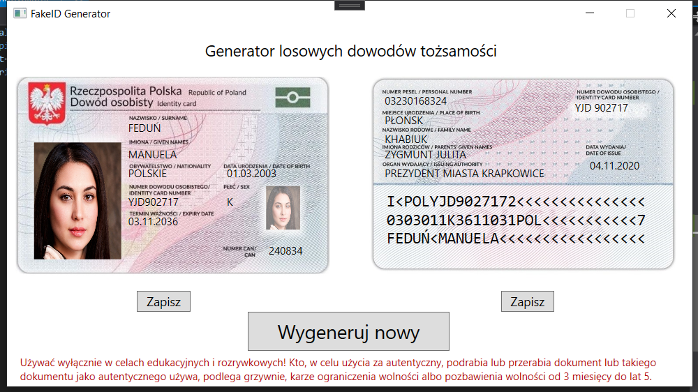

# Fake ID Generator
Generator fałszywych dowodów osobistych
## Co to jest?
Aplikacja pozwala wygenerować dowolny, losowy dowód osobisty (zgodny z najnowszym polskim wzorem).
## Instalacja
Instalator można pobrać [tutaj](https://users.tryton.vlo.gda.pl/s4/aplikacje/FakeID/setup.exe).
## Jak to działa?

Aby wygenerować nowy dowód osobisty, wystarczy kliknąć przycisk *wygeneruj nowy*.\
Dane można potem nieco zmodyfikować wg. własnego uznania.\
Następnie obie strony dowodu można zapisać, klikając przycisk *Zapisz*, odpowiednio pod awersem i rewersem.